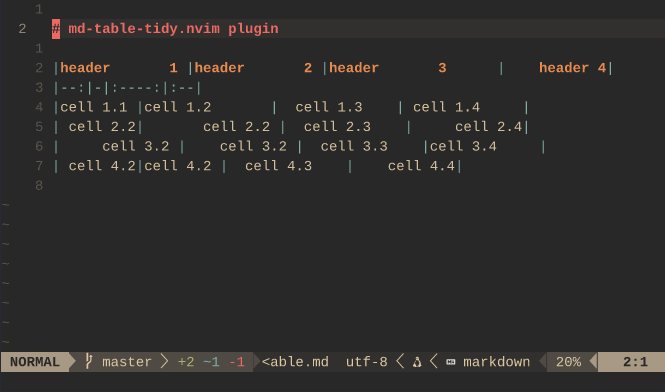

# md-table-tidy.nvim

A lightweight Neovim plugin for formatting markdown tables.
Just place your cursor anywhere inside a markdown table and trigger the formatter — it aligns pipes, cells, and headers for clean and readable output.



## Features

- Format a single table or all tables in the current buffer
- Optional: add padding to cells for better readability

## Requirements

- [nvim-treesitter](https://github.com/nvim-treesitter/nvim-treesitter)
- Tree-sitter parser for `markdown` (`:TSInstall markdown`)

## Setup

### Using [lazy.nvim](https://github.com/folke/lazy.nvim)

```lua
return { "timantipov/md-table-tidy.nvim",
    -- default config
    opts = {
        padding = 1,        -- number of spaces for cell padding
        keymap = {
          table_tidy = "<leader>tt", -- key for command :TableTidy<CR>
          table_tidy_all = "<leader>ta", -- key for command :TableTidyAll<CR>
        },
    }
}
```

## Usage

Format the table under the cursor: `<leader>tt` or execute command `:TableTidy`.
Format all tables in the current buffer: `<leader>ta` or execute command `:TableTidyAll`
